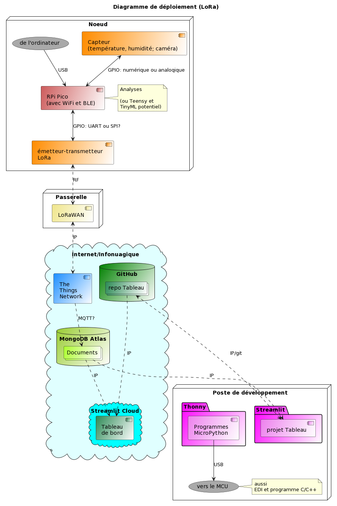
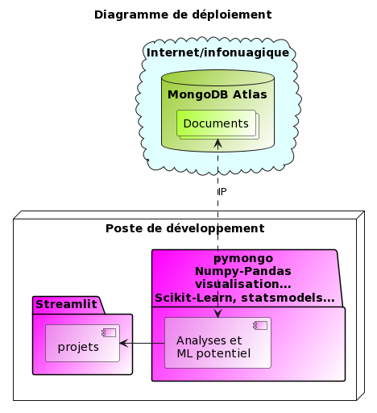
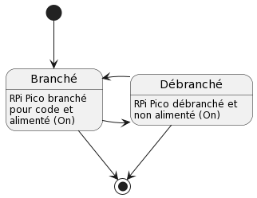
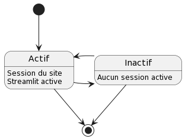

# Conception

explications

## Diagrammes de déploiement

explications

## Listes

- matériel
- logiciels, modules
- services
- db

- ?

## Diagrammes d'activité

explications, départ et arrivée

## Diagrammes d'états

explications, départ et arrivée

## Diagramme de classes

explications, RPi Pico (programmation fonctionnelle et de classe), aucune sur Streamlit (programmation fonctionnelle)

## Modèle de base de données

explications, NoSLQ, bd, collections, documents

