# Description et diagramme

Nous avons planifié le projet comme une première phase à un projet plus large. À la fin de cette phase, nous devrions avoir un application fonctionnelle. Les phases ultérieures ne serviraient qu'à améliorer l'application.

## Planification

Divers protocoles sans-fils sont utilisés en IoT; chaque a ses applications, ses avantages et ses faiblesses. LoRa est un protocole qui permet de transmettre de petits débits de données sures de longues portées.

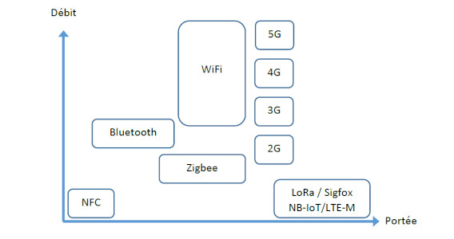

Le LoRa est très prisé en IoT. Ses avantages sont nombreux. Il est surtout connu pour:

- sa faible consommation d'énergie et sa longue durée,
- sa longue portée,
- son faible coût de déploiement et
- sa sécurité

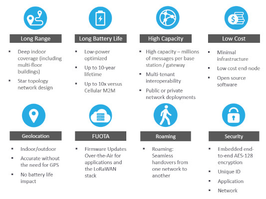

Un noeud (*node*), incluant un microcontrôleur, un capteur et un émetteur-récepteur LoRa, consomme peu d'énergie.

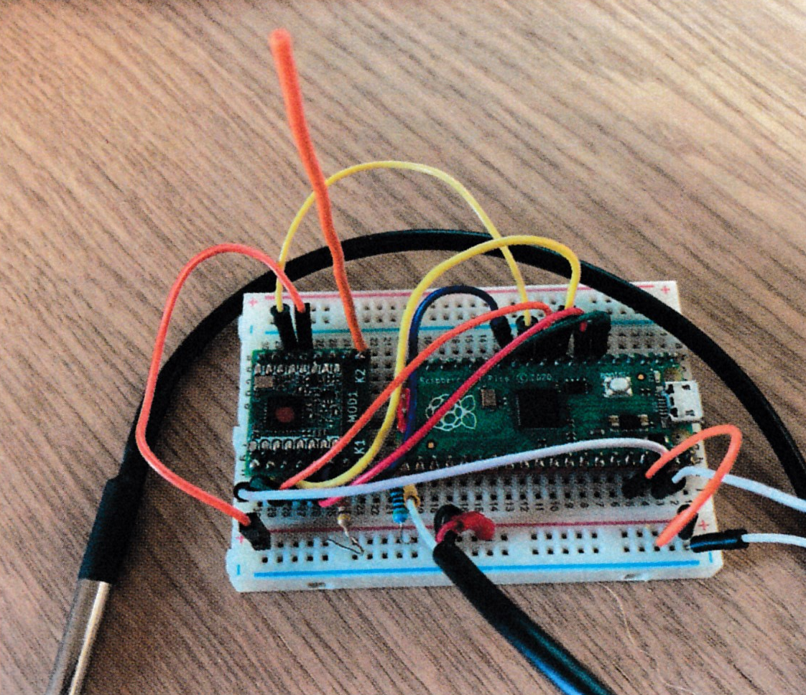

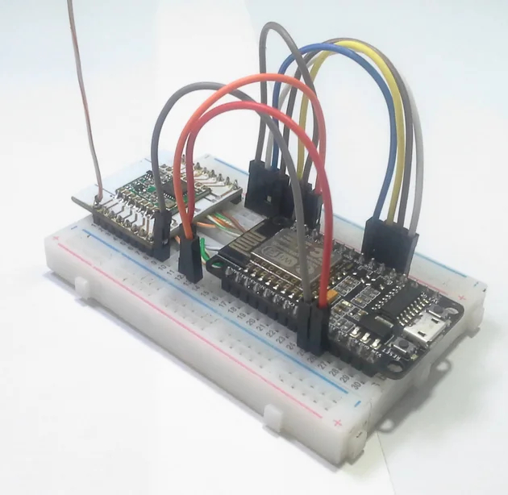

Un microcontrôleur de 3V consomme peu d'énergie (mesuré en mAh); la durée de vie des piles dépasse 1 an. Avec un système de recharge par panneau solaire, la durée de vie de la source d'alimentation se compte en années.[^annees]

[^annees]: LoRa, Sigfox, NB-LET sont des protocoles de la famille *Low Power WAN* ou LPWAN.

Ensuite, le noeud est ajouté à un réseau LoRaWAN. Il faut mettre en place ce réseau.

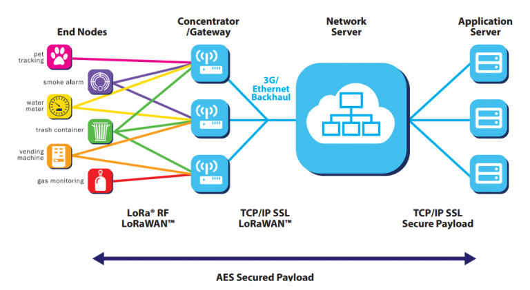

Les émissions d'une centaine de noeuds peuvent être captées par une passerelle (*gateway*). Grâce à la longue portée du LoRa, un parc de noeuds pourrait s'étaler sur plusieurs kilomètres carrés.

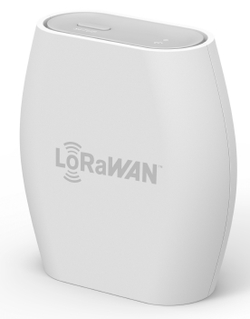

Un passerelle extérieure, de gamme industrielle, située en hauteur maximise la couverture du réseau.

Avec un bon paramétrage, une passerelle à 8 canaux peut gérer le trafic de centaines de noeuds. La mise en place d'un réseau comptant des noeuds et une passerelle est très abordable comparée à d'autres technologies.

Il est possible de construire une passerelle simple avec une carte LoRaWAN et un Raspberry Pi.

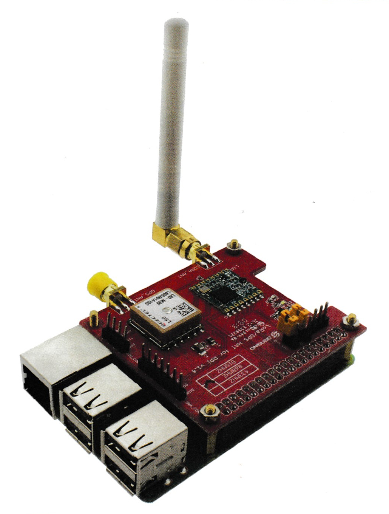

Un noeud peut mesurer son environnement chaque minute ou chaque heure, par exemple. À intervalles de temps déterminé, possiblement plus étendues que les intervalles des mesures, le noeud peut envoyer de petits messages à la passerelle comme des listes en MicroPython ou des arrays en C.

La passerelle achemine le flux de données vers des serveurs (applications, réseau et sécurité). Il est possible d'héberger les serveurs in situ, au coeur du réseau LoRaWAN. Cette solution requiert un investissement de base, de l'expertise pour son exploitation et des frais de gestion. La solution de rechange est d'impartir ces responsabilités. La passerelle achemine alors le flux de données vers des services par Internet: The Things' Network (ouvert), The People's Network (ouvert avec une chaine de blocs), The Things' Industries (payant, pour des usages industriels).

Tous les composants décrits plus haut ne sont pas des composants de stockage des données. Les données doivent être récupérées dans une base de données quelconque.

Consulter le **Diagramme de déploiement (LoRa)**, plus bas.

## ajustements

Cependant, la mise en place d'un réseau LoRaWAN est un investissement en temps et argent pour des particuliers. Une entreprise dispose de plus de ressources et le LoRa reste abordable comparé aux solutions de rechange. Si les échéanciers sont serrés et le budget est limité, le LoRa n'est pas la meilleure option pour débuter la mise en place d'une chaine IoT.

Une passerelle Raspberry Pi coûte le prix d'un kit Raspberry Pi plus une carte LoRaWAN (entre 150 et 200$C). Or, cette option était en rupture d'inventaire dans les boutiques et chez les fournisseurs en ligne ou le délai d'expédition était très long (6 semaines). Sinon, il faut se tourner vers des passerelles plus chères (300$C+) ou de gamme industrielle (500$C+). 

Les autres composants ne sont pas chers et facilement disponibles: un Raspberry Pi Pico (ou un ESP32), un émetteur-récepteur LoRa et un capteur de température se chiffrent à moins de 20$C chacun.

Le LoRa reste une technologie qui requiert une bonne étude pour la faire fonctionner.

Afin de démarrer plus rapidement et sans trop dépenser, nous nous sommes tournés vers le WiFi. Le Raspberry Pi Pico est disponible dans une version WiFi/Bluetooth. Ce qui permet d'utiliser un ordinateur comme passerelle pour capter les signaux du Pico. Nous pouvons ensuite envoyer le flux de données dans la chaine IoT.

Consulter le **Diagramme de déploiement (WiFi)**, plus bas. La deux chaines IoT (LoRa vs. WiFi) sont assez similaires. 

## Diagrammes de déploiement

Par rapport à la chaine IoT de l'article d'Elektor, nous remplaçons Node-RED par Streamlit pour construire une interface web.

La chaine IoT de rechange WiFi permet de démarrer plus rapidement sans trop dépenser d'argent.

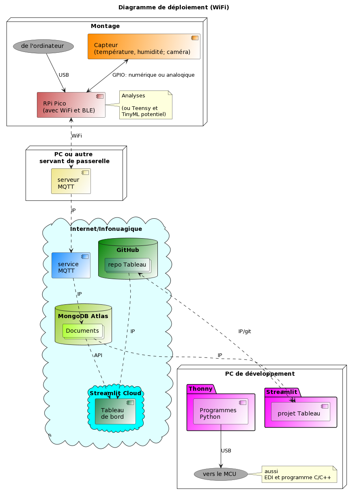

Nous allons éventuellement revenir vers le LoRa après un temps d'étude de cette technologie. La chaine IoT sera toujours en place. Il existe d'excellent ouvrages disponibles gratuitement en ligne comme le manuel LoRa - LoRaWAN et l'Internet des Objets de l'Université Savoie-Mont-Blanc. L'Université offre aussi des cours sur Udemy. Ce ne sont pas les ressources qui manquent en ligne.

Une fois la base de données en place, elle peut servir à davantage qu'à alimentation du tableau de bord.

## Diagrammes d'activité et d'état

Concentrons-nous sur ce qui se déroule à chaque bout de la chaine IoT.

### Raspberry Pi Pico

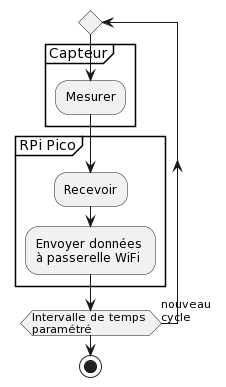

### Streamlit

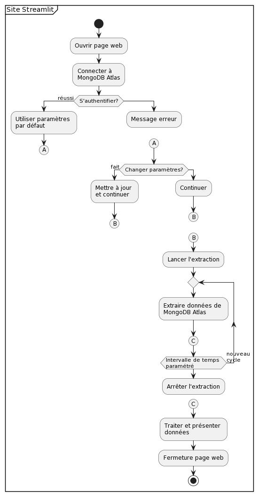

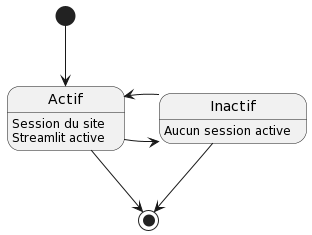

## Diagramme de classes

### Raspberry Pi Pico

???

### Streamlit

Avec son architecture actuelle, notre site n'est pas optimal.

Nous avons beaucoup appris comment faire les choses et, surtout, quoi éviter. Le site requiert une refonte.

Dans son état actuel, le site n'utilise que de la programmation fonctionnelle (fonctions, constantes, variables, dont les variables *session_state* de Streamlit).

Étant donné qu'il est possible de mettre le site à l'échelle pour gérer le flux de données de centaines d'objets, il faut penser construire le site avec de la programmation orientée objet (avec des classes). Cela demande un temps de réflexion et de planification.

Il faudrait consulter des experts du web pour établir les parallèles entre un autre cadriciel et Streamlit. Ce travail est nécessaire pour mieux comprendre la partie *back-end* qui reste assez opaque. Il est nécessaire de construire un site avec une bonne architecture pour assurer un fonctionnement fluide, une bonne expérience utilisateur et éviter les problèmes lors de mise à l'échelle (*scaling*).

## Modèle de base de données

Un IoT, il est possible de stocker les données dans des bases de données SQL ou NoSLQ. Nous avons choisi MongoDB. 

Selon l'article en ligne Building with Patterns: A Summary, de MongoDB, il existe divers patrons de conception de collections et de documents.

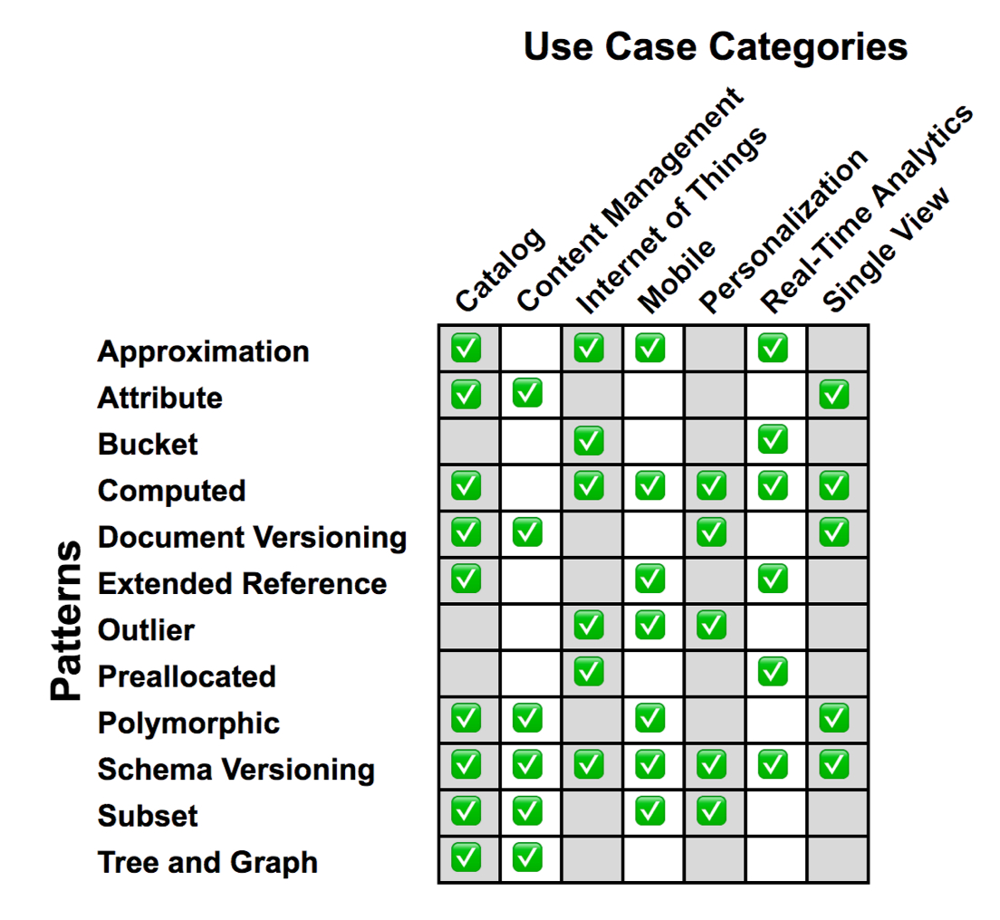

Le patron Bucket est préconisé en IoT comme démontré dans le cours M100 de Mongo University: MongoDB for SQL Pros.

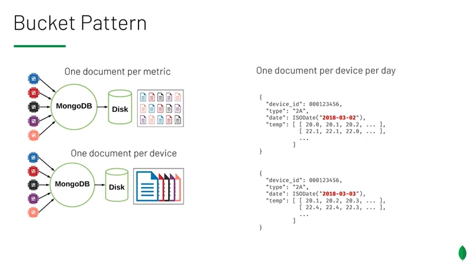

Le patron préconise:
.png
- 1 collection pour un parc de noeuds,
- 1 document par noeud par métrique (température, humidité, etc.) par jour ou
- 1 document par noeud par appareil (noeud 1 de température, noeud 2 d'humidité, etc.) par jour.

À des fins expérimentales, nous avons utilisé 1 collection de 1 document par noeud par métrique par mesure. Chaque document consiste en une valeur unique.

Notre modèle de documents génère beaucoup de données rapidement pour tester. Nous pourrions passer au patron Bucket une fois le système stabilisé. Chaque document consisterait en une structure de données pour toutes les mesures de la journée.

## Expérience avec le Raspberry Pi Pico

### Développement

Pour le développement, Windows n'a pas les pilotes de la connexion en série (Serial USB) afin de se connecter au Pico et de téléverser des codes sources en MicroPython. Le développement préparatoire peut se faire en Windows, mais pour embarquer un code source sur le Pico, il faut le faire avec une distribution Linux. Nous avons utilisé la distribution Linux Mint avec une machine virtuelle sur Windows.

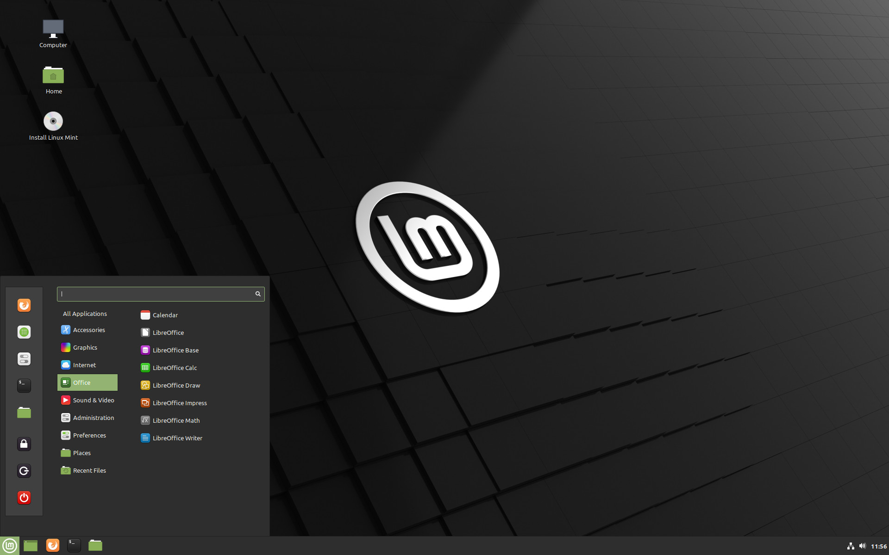

Notre but est que le Pico envoie des données à MongoDB Atlas. Par contre, nous pouvons simuler des données sur Windows et téléverser des données avec Compass, via des fichiers CSV ou JSON ou directement avec le module pymongo.

Avec le Pico, il faut passer par un serveur MQTT, ???Mosquitto, installé sur un ordinateur Windows. Le Pico, via le WiFi, communique avec le serveur sur le PC. Le PC achemine le flux de données à un service MQTT: MyQtt.

???Mosquitto, HiveHQ

Ensuite, le service MQTT envoie le flux de données à MongoDB Atlas.

??? PubNub (Optionnel)

Nous voulions garder de la marge de manoeuvre avec plusieurs possibilités à chaque étape de la chaine. Si une option flanchait, l'autre option deviendrait utile.

### Difficultés

Les premiers tests avec notre capteur température-humidité SEN0546 n'ont pas été concluants.

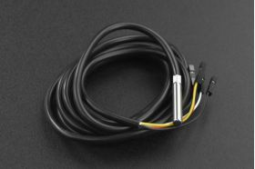

D'abord, les informations sur ce capteur sont confuses.

Ensuite les broches pour la connexion posent un autre problème. 

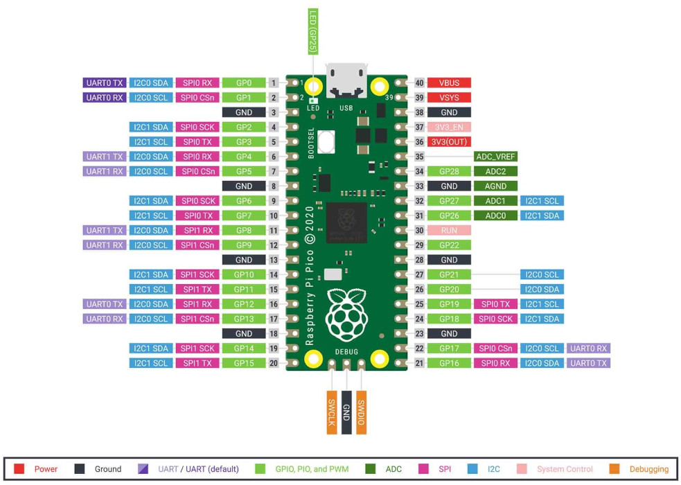

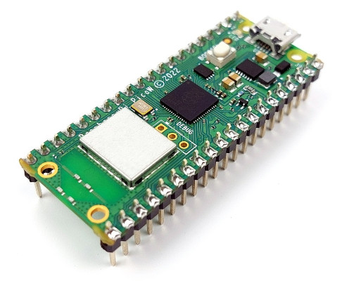

Desquelles est-il question? Physiques ou GPIO? Internet tout entier n'en parle pas. La seule documentation qui en fait allusion est le guide Get Started with MicroPython on Raspberry Pi Pico.

Le MicroPython est basé sur une version ancienne de Python (3.4 ou 3.5). Comme le nom l'indique, c'est un sous-ensemble du langage complet pour microcontrôleurs. La syntaxe est légèrement différente (suffisamment pour causer de sérieux problèmes).

Il faut adapter un code source Python en MicroPython lorsque l'on migre. Nous pouvons éprouver le sentiment d'être handicapé par les limites du MicroPython. Le MicroPython ne reconnait pas ou n'importe pas certaines variables, classes ou méthodes. Certains modules ne sont pas disponibles. L'affichage par `print()` est erratique; parfois effacé. 

La mémoire du Pico est aussi problématique. Un code source peut persister en mémoire même si le développeur fait une mise à jour. Il faut découvrir la solution: fermer Thonny, débrancher le Pico et redémarrer le tout avant de téléverser un nouveau code source.

Est-ce un problème avec Thonny ou le Pico? Internet tout entier n'en parle pas.

Au final, nous sommes arrivés au verdict qu'en MicroPython, les options de programmation sont limitées. Il n'a pas été possible de faire fonctionner le capteur correctement. Le capteur fournissait toujours des valeurs maximales, par exemple.

Le MicroPython n'est pas le choix idéal pour le protocole I2C. Le langage n'offre pas les opérations de bas niveau (proche du processeur) comme offertes par le C/C++.

En MicroPython, il aurait fallu utiliser un autre capteur. Il existe des modèles de capteurs plus simples.

Le capteur de température TMP37FT9Z.

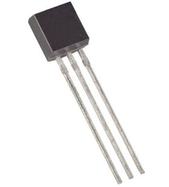

Les capteurs de température et d'humidité AM2320, DHT20 ou DHT11.

Peu importe le capteur, le C/C++ aurait été un meilleur langage pour avoir plus de marge de développement. Même qu'une solution de rechange au Pico, comme le ESP32, avec du C/C++, aurait été encore meilleure. Le ESP32 vient aussi dans une version WiFi comme le Pico.

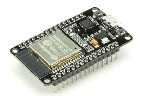

L'envoi de données du Pico vers MongoDB Atlas a révélé quelques surprises, dont les quotas journaliers qui limitaient le flux de données avec le service MQTT???. Avec un compte gratuit, il existe un quota sur le nombre d'envois par jour et des délais de 250ms par envoi. Parfois l'envoi ne passe pas.

Pour le développement, les tests, cette situation est problématique.

Au premier abord, nous étions perplexes devant la situation. Compte tenu de tous les problèmes discutés plus haut, nous pensions qu'il s'agissait d'un autre problème avec le Pico ou avec la programmation en MicroPython. Était-ce le serveur MQTT sur le PC? Nous n'avions pas ces problèmes lorsque nous travaillions directement avec MongoDB Atlas; avec Compass ou avec un code source Python (avec le module pymongo) sur PC.

Toutes ces péripéties nous ont fait perdre beaucoup de temps de développement.

Pour cette phase du projet, nous avions des ambitions de calculs à la pointe avec les données brutes: moyennes, contrôle de flux à certaines températures, alertes, etc. Toutes ces données constituent des envois différents à la base de données. La valeur obtenue réside dans le fait que l'objet fait une bonne partie de l'analytique et ne fait pas qu'émettre des données brutes.

L'investissement de temps à régler des problèmes nous a fait reculer sur d'autres options:

???HiveHQ, PubNub

### Succès

Chaque problème, de la programmation au service MQTT, a été surmonté. Nous devions travailler avec le Pico en MicroPython pour terminer la phase du projet. Adopter le C/C++, un autre microcontrôleur et/ou un autre capteur serait pour une phase ultérieure.

Grâce au capteur de température intégré au Pico, il est possible de capter une température pour l'envoyer à MongoDB Atlas.

Il est aussi possible de simuler des données de température et d'humidité avec le Pico avec de simples algorithmes; et de simuler plusieurs noeuds (pico01, pico02, etc.).

Une fois le système stabilisé, il est facile de retourner vers le serveur et le service MQTT; et de respecter les quotas.

### Conclusion

Le Raspberry Pi Pico est abordable et facile à apprendre. Le MicroPython aussi.

D'un autre côté, le MicroPython, en termes de possibilités de développement, est limité. Le langage est limité et son manque de paquets est limitatif. Le Pico doit aussi être programmé via un système d'exploitation Linux et non Windows ou Mac OS X.

Toutes les étapes se sont avérées beaucoup plus longues que prévu en raison des obstacles que nous affrontions. Il y a beaucoup de  recherches (blogues, documentation en ligne, sites, tutoriels, etc.) et de lectures à faire pour s'initier à la nouvelle matière; non seulement le LoRa, mais toutes les nouvelles technologies.

Voilà ce qui explique l'abandon de bien d’items que nous avions prévu faire au début du projet.

Il aurait fallu consulter des experts avant d'arrêter nos choix: du microcontrôleur, du capteur, du langage de programmation, etc. Il existe toute sorte de critères à évaluer avant d'embarquer dans un projet: coûts, potentiel de programmation, performance, durabilité, consommation d'énergie, etc. Nous l'avons appris à la dure.

C'est quand même une formidable expérience d'apprentissage. Beaucoup de nouvelles technologies et de précieuses leçons de développement.

Malgré que nous n'avons pas complété les exigences du produit final, nous avons une base solide qui nous servira lors des prochaines phases.

Websocket

???HiveHQ

???PubNub,

???protocole I2C

scale de 1 à 3

LoRa

une fois les 1 noeud en place et une passerelle, on pourrait installer jusqu'à 500 noeuds

envoi à tous les 10s, 30s, 10min, 1h, 1j, 1sem, selon le capteur

ajuster le tableau de bord dans ces nouvelles conditions

## Expérience avec Streamlit

Nous n'avons pas utilisé Node-RED. C'est un langage de programmation assez sommaire pour développer des preuves de concept rapidement.

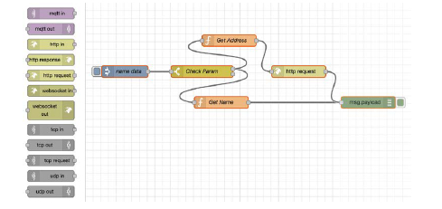

Nous avons aussi regardé Grafana et Flutter.

Nous voulions une solution avec langages écrits permettant plus de possibilités.

Nous avons pensé opter pour le cadriciel Python Flask pour construire un site web avec les langages web (HTML, CSS, JS).

Nous avons alors trouvé Streamlit.

### Développement

Streamlit est un module Python qui permet de construire des sites web et d'y incorporer facilement des modules scientifiques comme Numpy, Pandas, des modules de *Machine Learning* et d'IA. Il est possible d'y injecter un peu de HTML et de CSS. Le JS est intégré dans le code Python du module Streamlit; comme les fonctions asynchrones (*callback*), les états (*state*) et les changements d'états (*setState*).

Le résultat donne un site web réactif qui s'adapte à n'importe quel écran.

Le démarrage avec Streamlit est facile. Nous sommes rapidement arrivés à construire des sites web expérimentaux pour apprendre les composants du module. Il est possible d'émuler le travail sur un ordinateur.

### Difficultés

La suite a été plus ardue. Il faut du temps, plus que prévu, pour apprendre un gros module comme Streamlit. Cela fait partie des risques d'aller vers les nouveautés.

Tout est prévu avec Streamlit pour connecter un site à des sources de données sur l'ordinateur ou sur le web. Nous avons passé un certain temps à maitriser la connexion entre Streamlit et MongoDB Atlas et, surtout, à la sécuriser.

Les aspects de fonctions asynchrones (*callback*) et d'états (*state*) ont aussi pris un certain temps à maitriser.

### Succès

Le résultat donne un site interactif de grande qualité. Les fonctionnalités de Streamlit permettent on bonne personnalisation, mais nous nous sommes limité à un gabarit assez standard.

Streamlit n'est pas un cadriciel de site web complet. Il est spécialisé dans la construction d'interfaces web de présentation et d'interaction en science des données, en *Machine Learning*, en IA, en statistiques, en visualisation et toute autre utilisation connexe. L'offre de widgets d'interaction et d'options d'affichage colle à ces utilisations.

La connexion avec MongoDB Atlas est robuste et peut être sécurisée. Les extractions sont fluides. Le NoSQL s'avère un excellent choix qui donne aussi une flexibilité pour changer le modèle des documents en cours de route. Choses plus ardue avec le SQL qui est rigide. Nous n'avons pas testé de gros volumes et nous nous limité à moins de 3000 documents par collection.

Nous avons ensuite réussi à héberger le site en ligne pour le rendre accessible au grand public avec Streamlit Cloud. Il faut utiliser un fichier requirements.txt pour que Streamlit Cloud construise une version de notre site dans un environnement virtuel sur le nuage. Nous avons pensé tester Heroku, mais ce sera pour plus tard.

### Conclusion

Après de multiples tentatives, nous avons réussi à terminer un site:

- multipages,
- interactif, avec menus et sélections,
- avec une connexion à MongoDB Atlas,
- présentant des données avec tableaux et graphiques et
- avec un page de connexion en temps réel pour des mises à jour à intervalles réguliers (lorsque de nouvelles données entrent dans Atlas, elles peuvent être présentées).

L'architecture n'est pas optimale par manque d'expérience. Le site peut être lent, peu réactif dans certains cas. Il manque aussi beaucoup de fonctionnalités que nous avons abandonnées par manque de temps.

Streamlit offre un grand potentiel, mais requiert plus d'expérience pour le maitriser.