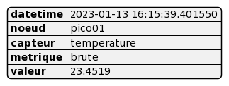

# Description et diagramme

## Planification et ajustements

Divers protocols sans-fils sont utilisés en IoT; chaque a ses applications, ses avantages et ses faiblesses. LoRa est un protocols qui permet de transmettre de petits débits de données sur de longues portées.

Le LoRa est très prisé en IoT. Ses avantages sont nombreux. Il est surtout connu pour:

- sa faible consommation d'énergie et sa longue durée,
- sa longue portée,
- son faible coût de déploiement et
- sa sécurité

Un noeud (*node*), incluant un microcontrôleur, un capteur et un émetteur-récepteur LoRa, consomme peu d'énergie.

Le noeud peut être alimenté à 3V avec une faible consommation (mesurées en mAh); et même un système de recharge avec un panneau solaire. La durée de vie de la source d'alimentation peut alors se compter en années.[^annees]

[^annees]: LoRa, Sigfox, NB-LET sont des protocols de la famille *Low Power WAN* ou LPWAN.

Ensuite, le noeud peut se joindre à un réseau LoRaWAN. Il faut mettre en place ce réseau.

Grâce à la longue portée du LoRa, un parc de noeuds pourrait s'étaler sur plusieurs kilomètres carrés. Le LoRa a une très bonne pénétration des structures. Les émissions d'une centaine de noeuds pourraient être captées par une passerelle (*gateway*) extérieure située en hauteur pour maximiser la couverture du réseau. 

Avec un bon paramétrage, une passerelle à 8 canaux peut gérer le trafic de centaines de noeuds.

Il est possible de construire une passerelle intérieure simple avec une carte LoRaWAN et un Raspberry Pi.

Un noeud peut mesurer son environnement à chaque minute ou chaque heure, par exemple. À intervalles de temps déterminée, possiblement plus étendues que les intervalles des mesures, le noeud envoie de petits messages à la passerelle comme des listes en MicroPython ou des arrays en C.

La passerelle achemine le flux de données vers des serveurs (applications, réseau et sécurité) sur le nuage comme The Things's Network.

Le noeud, la passerelle et le serveur ne sont pas des composants de stockage des données. Les données doivent être récupérées dans une base de données quelconque sinon les nouvelles données écrasent les anciennes sur la chaine.

Consulter le **Diagramme de déploiement (LoRa)**, plus bas.

Cependant, la mise en place d'un réseau LoRaWAN est un investissement en temps et argent pour des particuliers. Une entreprise dispose de plus de ressources et le LoRa reste abordable comparé aux solutions de rechange. Si les échéanciers sont serrés et le budget est limité, le LoRa n'est pas la meilleure option pour débuter le mise en place d'une chaine IoT.

Une passerelle Raspberry Pi coûte le prix d'un kit Raspberry Pi plus une carte LoRaWAN (entre 150 et 200$C). Les autres composants ne sont pas chers: un Raspberry Pico (ou un ESP32), un émetteur-récepteur LoRa et un capteur de température se chiffrent à moins de 20$C chacun. Encore faut-il que les composants soient disponibles. L'inventaire est volatile et les délais de livraison par la poste peuvent être longs.

Le LoRa reste une technologie qui requiert une bonne étude pour la faire fonctionner.

Afin de démarrer plus rapidement, nous nous sommes tourné vers le WiFi. Le Raspberry Pi Pico est disponible dans une version WiFi/Bluetooth. Ce qui permet d'utiliser un ordinateur comme passerelle pour capter les signaux du Pico. Nous pouvons ensuite envoyer le flux de données dans la chaine IoT.

Consulter le **Diagramme de déploiement (WiFi)**, plus bas. La deux chaines IoT (LoRa vs. WiFi) sont assez similaires. 

## Diagrammes de déploiement

Par rapport à la chaine IoT de l'article d'Elektor, nous remplaçons Node-RED par Streamlit pour construire une interface web.

La chaine IoT de rechange WiFi permet de démarrer plus rapidement sans trop dépenser d'argent.

Nous allons éventuellement revenir vers le LoRa après un temps d'étude de cette technologie. La chaine IoT sera toujours en place. Il existe d'excellent ouvrages disponible gratuitement en ligne commme le manuel LoRa - LoRaWAN et l'Internet des Objet de l'Université Savoie-Mont-Blanc. L'Université offre aussi des cours sur Udemy. Ce ne sont pas les ressources qui manquent en ligne.

Une fois la base de données en place, elle peut servir à davantage qu'à alimentation du tableau de bord.

## Diagrammes d'activité et d'état

Concentrons-nous sur ce qui se déroule à chaque bout de la chaine IoT.

### Streamlit

### Pico

## Diagramme de classes

### Pico

ici

### Streamlit

Avec son architecture actuelle, notre site n'est pas optimal.

Nous avons beaucoup appris comment faire les choses et, surtout, quoi éviter. Le site requiert une refonte.

Dans son état actuel, le site n'utilise que de la programmation fonctionnelle (fonctions, constantes, variables, dont les variables *session_state* de Streamlit).

Étant donnée qu'il est possible de mettre le site à l'échelle pour gérer le flux de données de centaines d'objets (*scalable*), il faut penser construire le site avec de la programmation orientée objets (avec des classes). Cela demande plus qu'une refonte, mais un temps de réflexion et de planification.

Il faudrait consulter des experts du web pour établir les parallèles entre un autre cadriciel et Streamlit. Ce travail est nécessaire pour mieux comprendre la partie *back-end* qui reste assez opaque. Il est nécessaire de construire un site avec une bonne architecture pour assurer un fonctionnement fluide, une bonne expérience utilisateur et éviter les problèmes lors de mise à l'échelle (*scaling*).

## Modèle de base de données

NoSLQ en IoT, flexible

article en ligne Building with Patterns: A Summary, de MongoDB

patron Bucket en IoT

cours de Mongo University, M100: MongoDB for SQL Pros

1 document par noeud pour chaque envoi

pourrait stabiliser à 1 document par neoud par jour ou autre intervalle de temps comme conseillé dans le cours

## Expérience avec le Pico

ici

### Mes tâches

ici

### Développement

### Succès

ici

### Difficultés et obstacles

ici

### Capteur et Protocole I2C

Capteur de température et d'humidité I2C
coque en acier inoxydable

https://abra-electronics.com/sensors/sensors-temperature-en/sen0546-i2c-temperature-and-humidity-sensor-stainless-steel-shell.html

ou

plus simple...

Module de capteur de température et d'humidité numérique haute précision AHT10

https://abra-electronics.com/sensors/sensors-temperature-en/aht10-high-precision-digital-temperature-and-humidity-sensor-module.html

Capteur de Température

https://abra-electronics.com/sensors/sensors-temperature-en/tmp37ft9z-temperature-sensor.html

Capteur de Température et Humidité

https://abra-electronics.com/sensors/sensors-temperature-en/sens-am-2320-digital-temperature-and-humidity-sensor-am2320.html

https://abra-electronics.com/sensors/sensors-temperature-en/sens-dht20.html

https://abra-electronics.com/sensors/sensors-temperature-en/sens-dht11-digital-temperature-humidity-sensor.html

Capteur numérique d'humidité de la température I2C

https://abra-electronics.com/sensors/sensors-temperature-en/sens-sht30-i2c-iic-serial-digital-temperature-humidity-sensor-breakout.html

### Internet

ici

### Broches

### Microcontrôleur

ou

aussi WiFi et Bluetooth comme le Pico

### MicroPython ou C ou C++?

- Pico est abordable, facile, MicroPython mais limité, capteurs, paquets, Linux
- ESP32 est ouvert, MicroPython, C/C++, capteurs, mais plus cher, plus complexe
- WIFI-ESP32, Micro-contrôleur IOT WiFi+Bluetooth BLE ESP-WROOM-32
- choix du MCU: coût, performance, durabilité selon les conditions, consommation énergie, potentiel de programmation
- Et on change de capteur pour avoir d'autres données. On met une cam avec un Teensy et ce dernier compte des objets en TinyML. Ça donne un payload différent à récupérer. FOMO
- Le MCU peut capter des données brutes (temp/s, hum/s), mais aussi calculer des stats à la pointe (moy 10min, tests de seuil de temp, tests de changement de temp, etc.). Tout ça est un différent payload lors de l'envoi à Atlas. Et on filtre à l'autre bout pour présenter
- tout type de données selon les capteurs, calcul à la pointe

### Cauchemar

ici

### Apprentissage

ici

### Choix techniques

ici

### Travail en équipe

ici

### Conclusion

ici

## Expérience avec Streamlit

Nous n'avons pas utilisé Node-RED. C'est un langage de programmation assez sommaire pour développer des preuves de concept rapidement.

Nous avons aussi regardé Grafana et Flutter.

Nous voulions une solution avec langages écrits permettant plus de possibilités.

Nous avons pensé opter pour le cadriciel Python Flask pour construire un site web avec les langages web (HTML, CSS, JS).

Nous avons alors trouvé Streamlit.

Streamlit est un module Python qui permet de construire des sites web et d'y incorporer facilement des modules scientifiques comme Numpy, Pandas, des modules de *Machine Learning* et d'IA. Il est possible d'y injecter un peu de HTML et de CSS. Le JS est intégré dans le code Python du module Streamlit; comme les fonctions asynchrones (*callback*), les états (*state*) et les changements d'états (*setState*).

Le résultat donne un site web réactif qui s'adapte à n'importe quel écran.

Le démarrage avec Streamlit est facile. Nous sommes rapidement arrivés à construire des sites web expérimenaux pour apprendre les composants du module. Il est possible d'émuler le travail sur un ordinateur.

La suite a été plus ardue. Il faut du temps, plus que prévu, pour apprendre un gros module comme Streamlit. Cela fait partie des risques d'aller vers les nouveautés.

Tout est prévu avec Streamlit pour connecter un site à des sources de données sur l'ordinateur ou sur le web. Nous avons passé un certain temps à maitriser la connexion entre Streamlit et MongoDB Atlas et, surtout, à la sécuriser.

Les aspects de fonctions asynchrones (*callback*) et d'états (*state*) ont aussi pris un certain temps à maitriser.

Le résultat donne un site interactif de grande qualité. Les fonctionnalité de Streamlit permettent on bonne personnalisation, mais nous nous sommes limité à un gabarit assez standard.

Nous avons ensuite réussi à hébergé le site en ligne pour le rendre accessible au grand public avec Streamlit Cloud. Il faut utiliser un fichier requirements.txt pour que Streamlit Cloud construise une version de notre site dans un environnement virtuel sur le nuage. Nous avons pensé tester Heroku, mais ce sera pour plus tard.

Après de multiples tentatives, nous avons réussi à terminer un site:

- multipages,
- interactif, avec menus et sélections,
- avec une connexion à MongoDB Atlas,
- présentatant des données avec tableaux et graphiques et
- avec un page de connexion en temps réel pour des mises à jour à intervalles réguliers (lorsque de nouvelles données entre dans Atlas, elles peuvent être présentées).

L'architecture n'est pas optimale par manque d'expérience. Le site peut être lent, peu réactif dans certains cas. Il manque aussi beaucoup de fonctionnalités que nous avons abandonnées par manque de temps.

Streamlit offre un grand potentiel, mais requiert plus d'expérience pour le maitriser.
