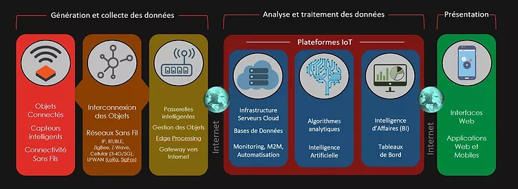
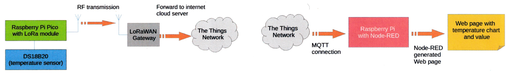

# Accueil

## Projet

L'objectif est de construire une chaine calquée sur le modèle d'AIoICanada. Un objet mesure des données environnementales quelconques, des données brutes et des statistiques issues de calculs à la pointe[^pointe]. Les données parcourent divers composants pour arriver dans une interface; comme un tableau de bord.

[^pointe]: Communément qualifié de *edge computing*.

## Idée du projet

Pour appliquer cette, nous nous sommes inspirés d'un article du magazine Elektor (version française) de juillet/août 2021.

L'article propose un projet de labo: LoRa avec le Raspbery Pi Pico, S'amuser avec MicroPython. Le projet consiste à capter des températures, de les transmettre via un réseau LoRaWAN. Ensuite, le flux de données est récupéré en temps réel grâce à un service MQTT pour être affiché sur une interface web Node-RED fonctionnant sur un Raspberry Pi.

## Application générale du projet

Ce genre de projet est classique en IoT. La valeur provient de la gestion de données. Une fois l'infrastructure en place, les données captées et les autres données obtenues par calculs à la pointe ou dans le tableau de bord permettent de renseigner les utilisateurs à des fins de gestions des revenus et des coûts.

Les usages sont nombreux:

- mesures automatisées,
- contrôle des états, de la qualité,
- prévention de pertes, d'accidents,
- alertes,
- etc. 

## Exemple d'application

Comme le projet tourne autour de la captation de température, nous pourrions implanter le projet dans le contrôle de la réfrigération.

Des organismes sans buts lucratifs recueillent des denrées pour les redonner. Ces organismes fonctionnent aussi avec des dons d'équipements. Ils utilisent des appareils de réfrigération récupérés dans des épiceries et des dépanneurs. Ces appareils en fin de vie peuvent flancher à tout moment.

Il faut contrôler la température pour éviter de perdre inutilement des denrées. L'application consiste à placer des capteurs dans les appareils pour recueillir des données. Un tableau de bord (page web) montre ces données à partir d'un PC dans les locaux administratifs des organismes. Le dispositif montre des données brutes, des statistiques et des alertes.

Ce tableau de bord permettrait aux organismes de suivre la situation à toute heure et de limiter leurs pertes avec les alertes (une température qui passe un seuil ou qui augmente rapidement).